# Современный CSS Reset

> Перевод статьи [A Modern CSS Reset](https://www.joshwcomeau.com/css/custom-css-reset/) от Joshua Comeau на русский язык.  
> Статья написана 23 ноября 2021, последнее обновление — 27 апреля 2026.

## Что тут происходит

Всякий раз, когда я начинаю новый проект, первым делом я сглаживаю некоторые шероховатости языка CSS. Я делаю это с помощью функционального набора собственных базовых стилей.

Долгое время я использовал знаменитый [CSS Reset Эрика Мейера](https://meyerweb.com/eric/tools/css/reset/). Это солидный кусок CSS, но сейчас он уже порядком устарел; он не обновлялся больше десяти лет, и с тех пор многое изменилось!

В последнее время я использую свой собственный CSS-ресет. Он включает все небольшие хитрости, которые я обнаружил для улучшения как пользовательского опыта, так и процесса написания CSS.

Как и другие CSS-ресеты, он не навязывает никаких дизайнерских или визуальных решений. Вы можете использовать этот ресет для любого проекта, независимо от выбранной эстетики.

В этом руководстве мы проведём обзор моего собственного CSS-ресета. Мы углубимся в каждое правило, и вы узнаете, что оно делает и почему вам, возможно, захочется его использовать!

> **Применение этого ресета к существующей кодовой базе**  
> Как правило, я не рекомендую пытаться применять какой-либо CSS-ресет к существующей кодовой базе. Всякий раз, когда мы вмешиваемся в базовые стили, мы рискуем что-то сломать незаметным образом, который можем не заметить мы (но заметят наши пользователи).  
> Если вы всё же решите пойти по этому пути, обязательно проведите тщательное тестирование, чтобы убедиться, что всё по-прежнему выглядит хорошо.

## Современный CSS-ресет

Без лишних слов, вот оно:

```css
/* 1. Более интуитивная модель box-sizing */
*,
*::before,
*::after {
  box-sizing: border-box;
}

/* 2. Удаление стандартных марджинов */
*:not(dialog) {
  margin: 0;
}

/* 3. Включение анимации ключевых слов */
@media (prefers-reduced-motion: no-preference) {
  html {
    interpolate-size: allow-keywords;
  }
}

body {
  /* 4. Увеличение высоты строки */
  line-height: 1.5;
  /* 5. Улучшение отображения текста */
  -webkit-font-smoothing: antialiased;
}

/* 6. Улучшение настроек по умолчанию для мультимедиа */
img,
picture,
video,
canvas,
svg {
  display: block;
  max-width: 100%;
}

/* 7. Наследование шрифтов для элементов управления форм */
input,
button,
textarea,
select {
  font: inherit;
}

/* 8. Избегание переполнения контейнера */
p,
h1,
h2,
h3,
h4,
h5,
h6 {
  overflow-wrap: break-word;
}

/* 9. Улучшение переноса строк */
p {
  text-wrap: pretty;
}
h1,
h2,
h3,
h4,
h5,
h6 {
  text-wrap: balance;
}

/*
  10. Создание корневого контекста наложения
*/
#root,
#__next {
  isolation: isolate;
}
```

Он довольно короткий, но в этой небольшой таблице стилей собрано много всего. Приступим!

> **Педантичное замечание**  
> Исторически основная цель CSS-ресета заключалась в обеспечении согласованности между браузерами и отмене всех стилей по умолчанию, создавая чистый лист. Мой CSS-ресет на самом деле не делает ни того, ни другого.  
> В наши дни у браузеров нет серьёзных расхождений, когда речь заходит о раскладке или отступах. В целом браузеры точно реализуют спецификацию CSS, и всё ведёт себя так, как вы ожидаете. Поэтому в этом больше нет особой необходимости.  
> Я также не считаю нужным полностью убирать все браузерные значения по умолчанию. Я, например, скорее всего хочу, чтобы теги `<em>` задавали `font-style: italic!` Я всегда могу принять иные дизайнерские решения в стилях конкретного проекта, но не вижу смысла отказываться от разумных стандартных настроек.
> Возможно, мой CSS-ресет не соответствует классическому определению «CSS reset», но я беру на себя эту творческую вольность.

## CSS Reset через Cascade Layers

Использование современного сброса внутри `@layer` — это лучший способ управления приоритетами в проекте.

**Реализация:**

```css
/* 1. Задаем иерархию (от слабого к сильному) */
@layer reset, base, layout, components;

/* 2. Оборачиваем код сброса */
@layer reset {
  /* Сюда вставляем весь Reset */
  *,
  *::before,
  *::after {
    box-sizing: border-box;
  }
  ...
}
```

**Преимущества:**

- **Минимальный приоритет:** Стили в слое `reset` будут «слабее» любых обычных стилей, написанных позже.
- **Никаких конфликтов:** Вам больше не придется повышать специфичность селекторов или использовать `!important`, чтобы перебить базовые настройки.
- **Порядок в коде:** Сброс четко изолирован от основной логики верстки.

## 1. Более интуитивная модель box-sizing

Небольшая проверка! Если измерять по видимой розовой рамке, какой ширины будет элемент `.box` в следующем сценарии, при условии, что другие CSS-стили не применялись?

```html
<style>
  .parent {
    width: 200px;
  }
  .box {
    width: 100%;
    border: 2px solid hotpink;
    padding: 20px;
  }
</style>

<div class="parent">
  <div class="box"></div>
</div>
```

У нашего элемента `.box` задано `width: 100%`. Поскольку его родитель имеет ширину 200 пикселей, эти 100% превратятся в 200 пикселей.

Но где именно применяются эти 200 пикселей ширины? По умолчанию этот размер будет применён к области содержимого (content box).

Если вы не знакомы с этим понятием, "content box" — это прямоугольник в блочной модели, который, собственно, и вмещает контент, находясь внутри рамки и внутренних отступов:

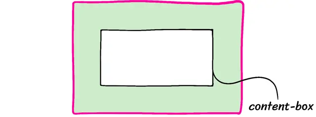

Объявление `width: 100%` установит ширину области содержимого элемента `.box` равной 200 пикселей. Внутренние отступы добавят ещё 40 пикселей (по 20 пикселей с каждой стороны). Рамка добавляет последние 4 пикселя (по 2 пикселя с каждой стороны). Если посчитать, видимый розовый прямоугольник окажется шириной 244 пикселя.

Когда мы пытаемся втиснуть блок шириной 244 пикселя в родительский контейнер шириной 200 пикселей, происходит переполнение.

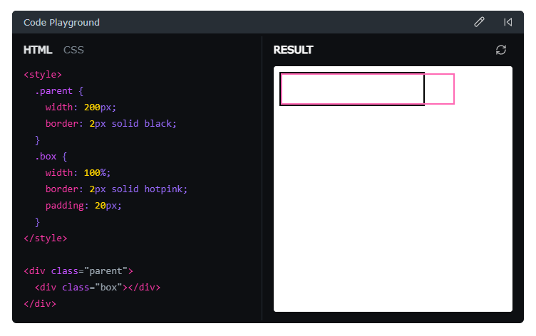

Поведение это странное, правда? К счастью, мы можем его изменить, установив следующее правило:

```css
*,
*::before,
*::after {
  box-sizing: border-box;
}
```

С этим правилом процентные значения будут рассчитываться на основе `border-box`. В примере выше наш розовый блок будет иметь ширину 200 пикселей, а внутренняя область содержимого сожмётся до 156 пикселей (200px - 40px - 4px).

Вместо того чтобы применять это свойство выборочно, я предпочитаю задавать его для всех элементов (с помощью универсального селектора `*`), а также для всех псевдоэлементов (`*::before` и `*::after`). Таким образом, это становится поведением по умолчанию для всех элементов. Вопреки распространённому мнению, [это не вредит производительности](https://www.paulirish.com/2012/box-sizing-border-box-ftw/).

**На мой взгляд, это правило из разряда обязательных.** Оно делает работу с CSS значительно приятнее.

### Наследование box-sizing

В интернете я встречал рекомендации делать так:

```css
html {
  box-sizing: border-box;
}
*,
*:before,
*:after {
  box-sizing: inherit;
}
```

Это может быть полезной стратегией, если вы пытаетесь перевести большой существующий проект на использование border-box. Но она не нужна, если вы начинаете совершенно новый проект с нуля. Для простоты я исключил этот приём из своего CSS-ресета.

#### Когда это может пригодиться

Во-первых, мы можем создать «устаревший» селектор, который переключит box-sizing на content-box — значение по умолчанию для свойства box-sizing:

```css
.legacy {
  box-sizing: content-box;
}
```

Затем, когда у нас есть часть приложения, ещё не переведённая на `border-box`, мы просто добавляем этот класс:

```html
<body>
  <header class="legacy">
    <nav>
      <!-- Устаревший код здесь -->
    </nav>
  </header>
  <main>
    <section>
      <!-- Современный код здесь -->
    </section>
    <aside class="legacy">
      <!-- Устаревший код здесь -->
    </aside>
  </main>
</body>
```

Почему это работает? Давайте подумаем, как вычисляются стили для элементов в этом фрагменте.

`<header>` присвоен класс "legacy", поэтому он использует `box-sizing: content-box`.

Его дочерний элемент, `<nav>`, имеет `box-sizing: inherit`. Поскольку его родитель настроен на `content-box`, этот элемент `nav` также получит `content-box`.

Тег `<main>` не имеет класса "legacy", поэтому он наследует значение от своего родителя, `<body>`. `<body>` наследует от `<html>`. А для `<html>` установлено значение `border-box`.

По сути, каждый элемент теперь будет определять поведение `box-sizing` от своего родителя. Если у него есть предок с классом "legacy", будет использоваться `content-box`. В противном случае он в конечном счёте унаследует значение от тега `html` и будет использовать `border-box`.

## 2. Удаление стандартных марджинов

```css
*:not(dialog) {
  margin: 0;
}
```

Некоторые HTML-теги по умолчанию имеют внешние отступы (margin), чтобы неоформленные HTML-документы выглядели аккуратно и были удобочитаемыми; например, каждый тег `<p>` имеет небольшой вертикальный отступ, чтобы между абзацами был чёткий визуальный разрыв.

Однако, когда я работаю над своими проектами, я хочу контролировать эти отступы самостоятельно. На мой взгляд, **margin** — это вопрос дизайна, а не то, что должно применяться по умолчанию. Поэтому я решил убрать margin почти у всех элементов в этом CSS-ресете, предполагая, что вы добавите нужные вам отступы в стилях вашего приложения.

Исключением является `<dialog>`. Этот элемент по умолчанию имеет `margin: auto`, что центрирует диалоговое окно в области просмотра, и я считаю это разумным поведением по умолчанию. Поэтому я исключил его из этого правила. Спасибо **Oriol** за подсказку!

## 3. Включение анимации ключевых слов

```css
@media (prefers-reduced-motion: no-preference) {
  html {
    interpolate-size: allow-keywords;
  }
}
```

Предположим, что мы создаём компонент в виде складного аккордеона, примерно такой:

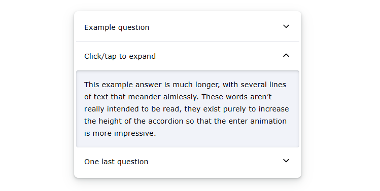

`Высота` каждого дочернего элемента изменяется от `0px` до `auto`. Исторически сложилось так, что анимировать это с помощью CSS-переходов было невозможно; приходилось измерять высоту элемента с помощью JavaScript. Сделать это хорошо на удивление сложно: если только вы не используете проверенную в боях библиотеку, скорее всего, появятся трудноуловимые ошибки.

Новое свойство `interpolate-size` исправляет это. Включив его, мы можем создавать переходы между абсолютными значениями (например, 0px) и вычисляемыми (например, auto). Оно даже работает с другими ключевыми словами размера, такими как `fit-content`!

Это означает, что можно использовать стандартные CSS-переходы, и всё будет работать идеально. Например:

```css
.accordion {
  height: 0px;
  transition: height 300ms;
  overflow: hidden;
}
.accordion[data-state='open'] {
  height: auto;
}
```

На момент написания (март 2025) это свойство поддерживается только в [Chrome/Edge](https://caniuse.com/mdn-css_properties_interpolate-size). Аккордеон выше от [Radix](https://www.radix-ui.com/primitives/docs/components/accordion) решает эту задачу с помощью JavaScript.

Однако, честно говоря, если только анимация не критична для пользовательского опыта, я считаю, что начинать использовать эту функцию уже можно. Запасной вариант — отсутствие анимации — вполне приемлем для большинства случаев. Подробнее об этой философии я рассказываю в своём посте [«A Framework for Evaluating Browser Support»](https://www.joshwcomeau.com/css/browser-support/).

В этом CSS-ресете я поместил объявление `interpolate-size` внутрь медиа-запроса `prefers-reduced-motion`. Это помогает гарантировать, что мы случайно не создадим проблем людям с чувствительностью к движению.

Также стоит отметить: когда это возможно, для изменения размера элемента всё же лучше использовать `transform: scale`, а не `height` или `width`. Это гораздо производительнее и даёт более плавное аппаратно-ускоренное движение.

Узнать больше об этой новой функции можно в моём сниппете `Keyword Transitions`.

> **Почему это опция, которую нужно включать вручную?**  
> Возможно, вы задаетесь вопросом, почему нам нужно явно включать эту новую функцию с помощью атрибута `interpolate-size`. Почему бы не сделать это стандартным поведением?
> Это было сделано в целях обратной совместимости, чтобы существующие веб-сайты не стали внезапно отображать анимацию, которая никогда не была запланирована.

## 4. Увеличение высоты строки

```css
body {
  line-height: 1.5;
}
```

Свойство `line-height` управляет вертикальным интервалом между строками текста в абзаце. Значение по умолчанию различается в разных браузерах, но, как правило, составляет около 1.2.

Это безразмерное число представляет собой коэффициент, зависящий от размера шрифта. Оно работает точно так же, как единица `em`. При `line-height` равном 1.2 каждая строка будет на 20% больше размера шрифта элемента.

Проблема в том, что когда строки текста расположены слишком близко друг к другу, текст становится труднее читать, особенно людям с дислексией. Принято считать, что значения `line-height` около 1.5 более удобны для основного текста. Поэтому в своём CSS-ресете я устанавливаю его как значение по умолчанию.

Однако это число, как правило, создаёт довольно большие межстрочные интервалы в заголовках и других элементах с крупным шрифтом:

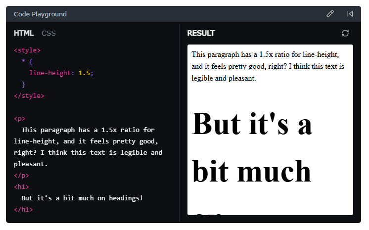

В результате я обычно выбираю меньшие значения высоты строки для заголовков, но конкретные значения зависят от дизайна приложения, поэтому я не включаю их в свой CSS-сброс.

> **Требования доступности**  
> До недавнего времени я считал, что WCAG требует, чтобы основной текст имел минимальную высоту строки `(line-height)` 1.5, но это не совсем так.  
> Требование заключается в том, чтобы конечный пользователь мог изменить высоту строки как минимум до 1.5 без нарушения макета. Иными словами, пользователи должны иметь возможность зайти в настройки браузера и увеличить стандартную высоту строки до большего значения, а наши сайты должны корректно реагировать на это изменение.  
> Лично я предпочитаю «встраивать» подобные вещи в свои сайты и приложения, чтобы пользователям не приходилось прилагать усилия, делая контент доступным для себя. Как бонус, это снимает с меня лишнюю заботу при тестировании доступности: мне не нужно периодически увеличивать высоту строки, чтобы проверить, всё ли по-прежнему работает, ведь значение уже выбрано с учётом доступности.  
> Узнать больше можно здесь: [WCAG “Text Spacing” criteria](https://www.w3.org/WAI/WCAG21/Understanding/text-spacing.html)

### Более умные межстрочные интервалы с помощью «calc»

Я экспериментировал с альтернативным способом управления высотой строки. Вот он:

```css
{
line-height: calc(1em + 0.5rem);
}
```

Это довольно продвинутый небольшой фрагмент кода, и его подробное описание выходит за рамки этой статьи, но если вам интересно, я дам краткое объяснение здесь.

Вместо вычисления высоты строки умножением размера шрифта на коэффициент, например 1.5, этот альтернативный подход использует размер шрифта как базу и добавляет фиксированную величину пространства к каждой строке.

Для основного текста, такого как абзацы, это объявление не даёт никакого эффекта; в обоих случаях высота строки составит 24 пикселя (при стандартном размере шрифта браузера).

Однако на крупном тексте это объявление создаёт более плотные строки.

**Будьте осторожны.** Я всё ещё в процессе тестирования этого метода.

Один из недостатков заключается в том, что приходится задавать это свойство для всех элементов с помощью `*`, а не применять его к `body`. Причина в том, что единица `em` плохо наследуется; значение `1em` не будет пересчитываться для каждого элемента. В моем блоге, например, такой подход сломал мои песочницы для кода, потому что сторонний код исходил из того, что `line-height` наследуется, как это обычно и бывает.

Подробнее об этой технике читайте в замечательной статье Хесуса Рикарте: [Using calc to figure out optimal line-height](https://kittygiraudel.com/2020/05/18/using-calc-to-figure-out-optimal-line-height/).

## 5. Улучшение отображения текста

```css
body {
  -webkit-font-smoothing: antialiased;
}
```

Итак, этот пункт может вызвать споры.

На компьютерах с macOS браузер по умолчанию использует «субпиксельное сглаживание». Это метод, направленный на улучшение читаемости текста за счёт использования красного, зелёного и синего субпикселей внутри каждого пикселя.

Раньше это считалось победой для доступности, поскольку повышало контрастность текста. Возможно, вы читали популярную статью [«Stop “Fixing” Font Smoothing»](https://usabilitypost.com/2012/11/05/stop-fixing-font-smoothing/), в которой не рекомендуется переключаться на «antialiased».

Проблема в том, что эта статья была написана в 2012 году, до эры дисплеев «retina» с высокой плотностью пикселей. Сегодняшние пиксели гораздо мельче, неразличимы невооружённым глазом.

Физическое расположение пиксельных светодиодов тоже изменилось. Если посмотреть на современный монитор под микроскопом, вы больше не увидите упорядоченной сетки из линий R/G/B.

В macOS Mojave, выпущенной в 2018 году, **Apple отключила субпиксельное сглаживание** по всей операционной системе. Я предполагаю, что они поняли: на современном оборудовании от него больше вреда, чем пользы.

Сбивает с толку то, что браузеры для macOS, такие как Chrome и Safari, по умолчанию до сих пор используют субпиксельное сглаживание. Нам необходимо явно отключить его, установив свойство `-webkit-font-smoothing` в значение `antialiased`.

Вот в чём разница:

> Antialiased

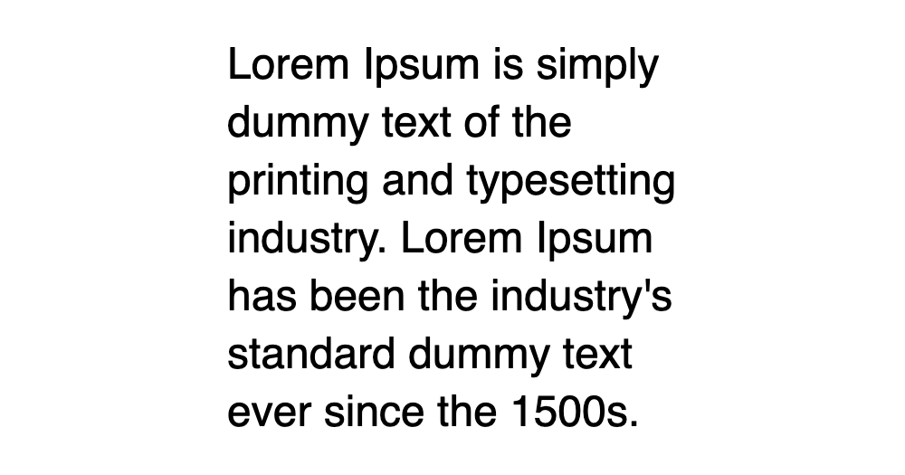

> Subpixel


macOS — единственная операционная система, в которой используется субпиксельное сглаживание, поэтому это правило не действует в Windows, Linux и на мобильных устройствах.

## 6. Улучшение настроек по умолчанию для мультимедиа

```css
img,
picture,
video,
canvas,
svg {
  display: block;
  max-width: 100%;
}
```

Итак, вот странная вещь: изображения считаются «строчными» `(inline)` элементами. Это подразумевает, что они должны использоваться внутри абзацев, как `<em>` или `<strong>`.

Это не стыкуется с тем, как я использую изображения в большинстве случаев. Обычно я отношусь к изображениям так же, как к абзацам, заголовкам или боковым панелям — это элементы макета.

Но если мы попытаемся использовать строчный элемент в макете, начинают происходить странные вещи. Если вы когда-нибудь сталкивались с загадочным отступом в 4px, который не был ни margin, ни padding, ни border, — скорее всего, это было **«встроенное магическое пространство»**, которое браузеры добавляют с учётом `line-height`.

Устанавливая `display: block` для всех изображений по умолчанию, мы избегаем целой категории несуразных проблем.

Я также задаю `max-width: 100%`. Это делается для того, чтобы большие изображения не выходили за границы контейнера, если тот недостаточно широк, чтобы вместить их.

Большинство блочных элементов автоматически растягиваются или сжимаются под родителя, но медиа-элементы, такие как ``, особенные: они называются замещаемыми элементами и не подчиняются тем же правилам.

Если изображение имеет «родной» размер 800×600, элемент `` также будет шириной 800px, даже если мы поместим его в родительский контейнер шириной 500px.

Это правило предотвратит выход изображения за пределы контейнера, что, на мой взгляд, является куда более разумным поведением по умолчанию.

### Проблемные крайние случаи

В большинстве случаев мы не хотим, чтобы изображения переполняли контейнер, но иногда это необходимо. Например, у нас может быть что-то вроде такого:

```css
img.oversized {
  position: absolute;
  width: 120%;
  left: -10%;
  right: -10%;
}
```

С моим CSS-ресетом это отобразится некорректно; объявление `max-width: 100%` ограничит ширину элемента, не давая ему увеличиться до заданных 120%.

Чтобы это исправить, отмените объявление `max-width` для данного конкретного элемента:

```css
img.oversized {
  position: absolute;
  width: 120%;
  max-width: revert;
  left: -10%;
  right: -10%;
}
```

Я хотел подчеркнуть этот момент, потому что слышал от нескольких читателей, столкнувшихся с проблемами из-за этого правила. Теперь, когда вы знаете о такой возможности, надеюсь, это не застанет вас врасплох!

## 7. Наследование шрифтов для элементов управления форм

```css
input,
button,
textarea,
select {
  font: inherit;
}
```

Вот ещё одна странность: по умолчанию кнопки и поля ввода не наследуют типографские стили от своих родителей. Вместо этого у них есть собственные странные стили.

Например, `<textarea>` использует системный моноширинный шрифт. Текстовые поля ввода — системный шрифт без засечек. И оба выбирают микроскопически маленький размер шрифта (13.333px в Chrome).

Как нетрудно догадаться, читать текст размером 13px на мобильном устройстве очень тяжело. Когда мы фокусируем поле ввода с мелким шрифтом, браузер автоматически приближает его, чтобы текст было легче читать.

К сожалению, это не самый приятный опыт:

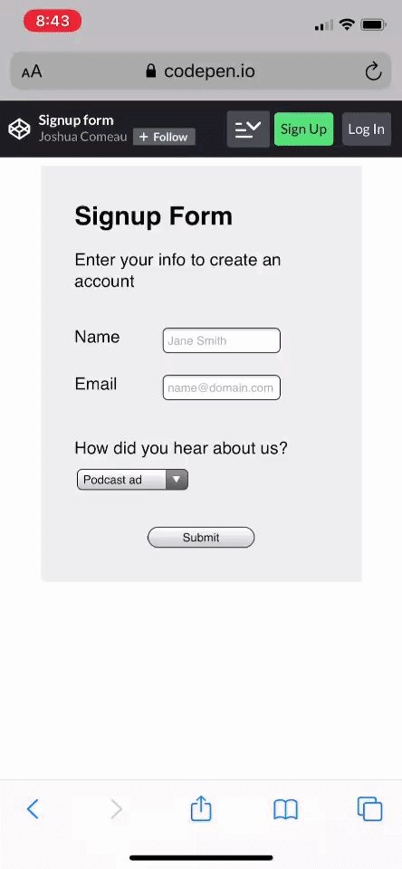

Если мы хотим избежать такого автозума, размер шрифта в полях ввода должен быть не менее 1rem / 16px. Вот один из способов решить проблему:

```css
input,
button,
textarea,
select {
  font-size: 1rem;
}
```

Это исправляет ситуацию с автозумом, но это скорее заплатка. Давайте устраним первопричину: у элементов формы не должно быть собственных типографских стилей!

```css
input,
button,
textarea,
select {
  font: inherit;
}
```

`font` — редко используемое сокращённое свойство, которое задаёт сразу несколько параметров шрифта: `font-size`, `font-weight`, `font-family` и другие. Устанавливая его в `inherit`, мы говорим этим элементам наследовать типографику от окружающего контекста.

Пока мы не выбираем неприлично маленький размер шрифта для основного текста, это разом решает все наши проблемы. 🎉

## 8. Избегание переполнения контейнера

```css
p,
h1,
h2,
h3,
h4,
h5,
h6 {
  overflow-wrap: break-word;
}
```

В CSS текст автоматически переносится на новую строку, если на одной строке недостаточно места для всех символов.

По умолчанию алгоритм ищет возможности «мягкого переноса» — символы, по которым строку можно разорвать. В английском языке мягкий перенос возможен только по пробелам и дефисам, но в разных языках это работает по-разному.

Если в строке нет подходящего места для мягкого переноса и она не умещается, текст выйдет за пределы контейнера:

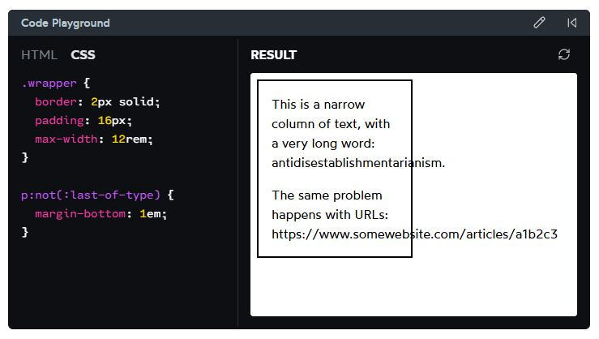

Это может привести к неприятным проблемам вёрстки: тут появляется горизонтальная полоса прокрутки, а в других ситуациях текст может наложиться на соседние элементы или скрыться за изображением/видео.

Свойство `overflow-wrap` позволяет настроить алгоритм переноса строк и разрешить «жёсткий» перенос, когда возможности для мягкого переноса отсутствуют:

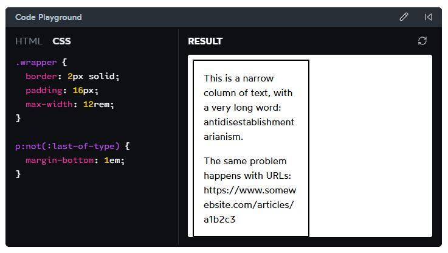

> Ни одно из решений не идеально, но хотя бы жёсткий перенос не сломает макет!

Спасибо **Софи Альперт** за похожее правило! Она советует применять его **ко всем элементам** — вероятно, это хорошая идея, но я лично не тестировал такой подход.

Можно также попробовать добавить свойство `hyphens`:

```css
p {
  overflow-wrap: break-word;
  hyphens: auto;
}
```

`hyphens: auto` использует дефисы (в тех языках, где это принято) для обозначения жёстких переносов и делает такие переносы гораздо более частыми.

Это бывает полезно для очень узких колонок текста, но может и отвлекать. Я решил не включать это в свой сброс стилей, но поэкспериментировать стоит!

## 9. Улучшение переноса строк

Когда в строке не хватает места для всех слов, по умолчанию непоместившиеся слова переносятся на следующую строку. Процесс повторяется, пока ни одна из строк не выходит за границы.

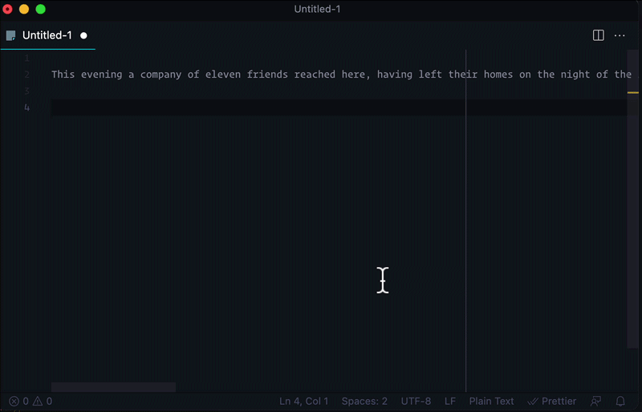

В большинстве случаев этот алгоритм работает нормально, но иногда даёт некрасивые результаты. Мой самый нелюбимый пример — когда абзац заканчивается эмодзи, и этот эмодзи переносится на отдельную строку.

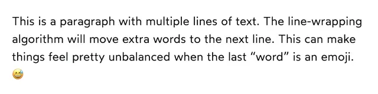

Чтобы решить эту проблему, мы можем выбрать альтернативный алгоритм переноса с помощью нового свойства `text-wrap`!

Для абзацев я использую значение `pretty`. Этот алгоритм гарантирует, что последняя строка текста будет содержать хотя бы два слова. Также он делает другие деликатные улучшения для визуального баланса абзаца.

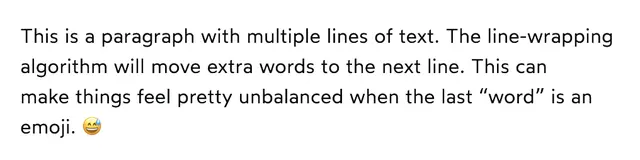

Для заголовков я выбираю значение `balance`. Эффект здесь гораздо сильнее: алгоритм старается сделать все строки текста примерно одинаковой длины. Благодаря этому заголовки из двух строк выглядят заметно гармоничнее.

Это не всегда то, что нам нужно, но смысл сброса стилей CSS в том, чтобы задать более удачные базовые стили. Мы всегда можем переопределить это свойство для любого конкретного заголовка или абзаца.

Поддержка `text-wrap` браузерами зависит от значения; на момент написания (ноябрь 2024) поддержка `pretty` [составляет 72%](https://caniuse.com/mdn-css_properties_text-wrap_pretty), а `balance` — [87%](https://caniuse.com/css-text-wrap-balance). Цифры не отличные, но это не страшно: как я писал в недавней заметке, о поддержке таких прогрессивных улучшений можно не беспокоиться.

> **Вопросы производительности**  
> В [документации MDN](https://developer.mozilla.org/en-US/docs/Web/CSS/Reference/Properties/text-wrap#description) для этого свойства предупреждается, что использование `text-wrap: pretty` может негативно сказаться на производительности, так как алгоритму приходится выполнять больше работы при расчёте макета.
> Я сделал быстрый тест на своём древнем бюджетном ноутбуке с Intel Celeron: замерял время отрисовки этой статьи блога с `text-wrap: pretty` и без него. Заметной разницы в скорости между двумя вариантами не обнаружилось. Более того, самый быстрый из десяти тестовых запусков был как раз с включённым `text-wrap: pretty`!
> Каждый проект уникален, и всегда разумно проверять такие вещи на своём контексте. Но я не думаю, что это свойство вызовет проблемы с производительностью в большинстве проектов.

## 10. Создание корневого контекста наложения

```css
#root,
#__next {
  isolation: isolate;
}
```

Это последний пункт, он необязательный. Обычно он нужен, только если вы используете JS-фреймворк вроде React.

Как мы видели в статье [«What The Heck, z-index??»](https://www.joshwcomeau.com/css/stacking-contexts/), свойство `isolation` позволяет создать новый контекст наложения без необходимости задавать `z-index`.

Это полезно, потому что гарантирует: определённые высокоприоритетные элементы (модальные окна, выпадающие списки, тултипы) всегда будут отображаться поверх остальных элементов приложения. Никаких странных багов с контекстом наложения, никакой гонки z-index.

Селектор стоит подстроить под ваш фреймворк. Нужно выбрать элемент верхнего уровня, внутри которого рендерится приложение. Например, `create-react-app` использует `<div id="root">`, поэтому правильный селектор — `#root`.

Вот ещё раз CSS-сброс в сжатом, в удобном для копирования виде:

```css
/*
  Josh's Custom CSS Reset
  https://www.joshwcomeau.com/css/custom-css-reset/
*/

*,
*::before,
*::after {
  box-sizing: border-box;
}

*:not(dialog) {
  margin: 0;
}

@media (prefers-reduced-motion: no-preference) {
  html {
    interpolate-size: allow-keywords;
  }
}

body {
  line-height: 1.5;
  -webkit-font-smoothing: antialiased;
}

img,
picture,
video,
canvas,
svg {
  display: block;
  max-width: 100%;
}

input,
button,
textarea,
select {
  font: inherit;
}

p,
h1,
h2,
h3,
h4,
h5,
h6 {
  overflow-wrap: break-word;
}

p {
  text-wrap: pretty;
}
h1,
h2,
h3,
h4,
h5,
h6 {
  text-wrap: balance;
}

#root,
#__next {
  isolation: isolate;
}
```

Не стесняйтесь копировать и вставлять это в свои проекты! Код опубликован без каких-либо ограничений, как общественное достояние (хотя, если вы сохраните ссылку на этот пост, я буду признателен!).

Я решил не выпускать этот сброс как NPM-пакет, потому что считаю: сброс должен быть вашим. Перенесите его в проект и дорабатывайте со временем, когда узнаёте новое или находите новые приёмы. Если захотите, всегда можно создать собственный NPM-пакет, чтобы переиспользовать код в разных проектах. Просто помните: этот код ваш, и он должен расти вместе с вами.

Спасибо Энди Беллу за его [Modern CSS Reset](https://piccalil.li/blog/a-more-modern-css-reset/). Это помогло отточить мои мысли и вдохновило на этот пост!

## Список изменений

- Март 2026 — Обновлено объяснение `line-height`, чтобы корректно описать требования WCAG.
- Декабрь 2025 — Из правила сброса отступов исключён тег `<dialog>`.
- Март 2025 — Добавлено свойство `interpolate-size` для включения анимаций в `auto`, `fit-content` и т.д.
- Октябрь 2024 — Добавлен пункт #8, улучшающий перенос строк с помощью `text-wrap`.
- Июнь 2023 — Убрано `height: 100%` из `html` и `body`. Это правило было добавлено, чтобы можно было использовать высоту в процентах внутри приложения. Теперь, когда [динамические единицы вьюпорта](https://web.dev/blog/viewport-units?hl=ru) широко поддерживаются, этот хак больше не нужен.
